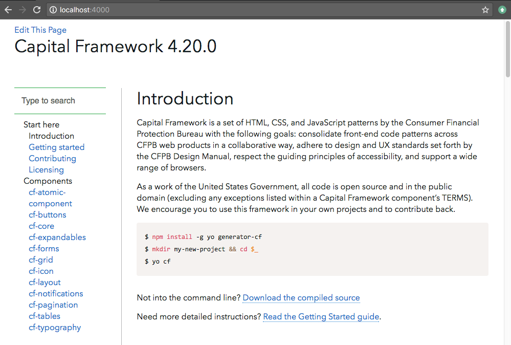

# gitbook-plugin-theme-cfpb
GitBook theme for Consumer Financial Protection Bureau projects.

Modified from the [default theme for GitBook](https://github.com/GitbookIO/theme-default/).



## Installation

In your GitBook `books.json`, we recommend this plugin configuration:

```
{
  …
  "plugins": [
    "theme-cfpb",
    "-theme-default",
    "-fontsettings",
    "-highlight",
    "-sharing",
    "auto-summary",
    "styles-less",
    "edit-link",
    "prism"
  ],
  "variables": {
    "title": "CFPB Docs"
  }
  …
}
```
Then run `gitbook.js build` after GitBook CLI is installed.
